# Тулинг

использовать URL: https://www.rigla.ru

- [Стандартный режим](#standart-mode)
- [Замедление CPU 4x slowdown и эмуляцию сети Slow 3G](#slow-mode)

Дополнительные ссылки на профили (network, performance ) в гугл диск:

- [Стандартный network]()
- [Стандартный performance]()
- [Замедленный network]()
- [Замедленный performance](https://drive.google.com/file/d/18hbbPSU9JXHLpP1mEjeZ_nb5hvp6bs9i/view?usp=sharing)

> Perfomance профиль с замедлением не загрузился на гитхаб.

<h1 id="standart-mode">Стандартный режим</h2>

## На вкладке Network:

### Записать и сохранить в HAR архив профиль загрузки ресурсов при открытии страницы:

[rigla-standart.ru.har](files\www.rigla-standart.ru.har)

### Дублирование ресурсов:

Два продублированных запроса в связке (OPTIONS preflight + GET):

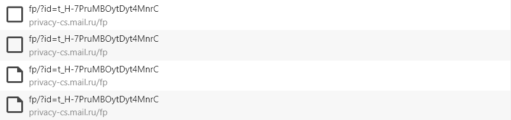

Запросы возвращают одинаковое тело ответа:

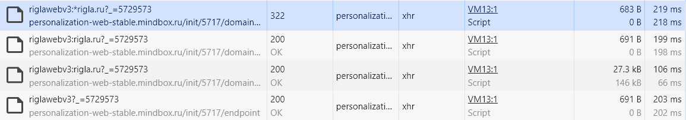

У двух из трех POST запросов одинаковое тело:

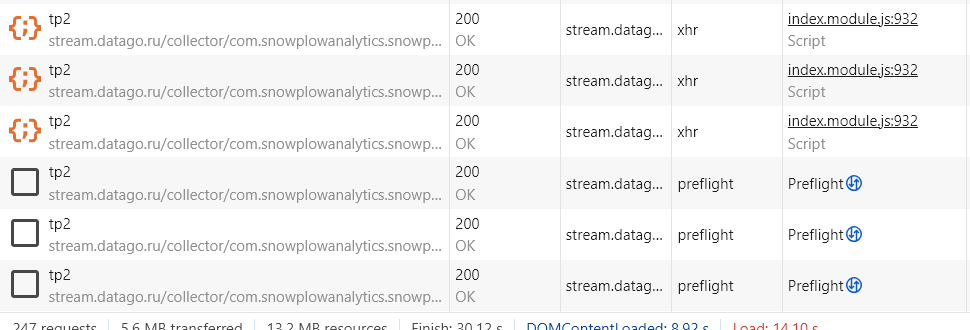

### Лишний размер ресурсов:

Ресурсы, у которых resource size = 0, а вес transferred over network заняли заголовки и т.п. (причем вес transferred over network не пропорционален весу заголовков).

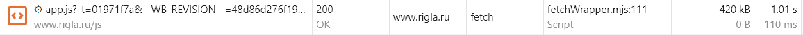

На самом деле, кроме этих двух запросов особо отметить нечего. Большинство ресурсов имеют заголовок для сжатия (gzip), либо их размер слишком мал.

> Я не стал добавлять сюда картинки и шрифты, потому что, по своей идее, их форматы уже должны быть сжаты. Повторное сжатие (gzip, br) часто не дает значительного уменьшения размера или даже может его увеличить.

> В качестве еще одного способа уменьшить количество передаваемой информации можно отметить редукцию (объединение нескольких условных JS файлов в один). Однако в этом случае нужно лучше понимать клиентский код.

### Медленно загружающие ресурсы

Ресурсы с наибольшим временем загрузки (DNS, TCP, SSL, wait, TTFB, TTLB)

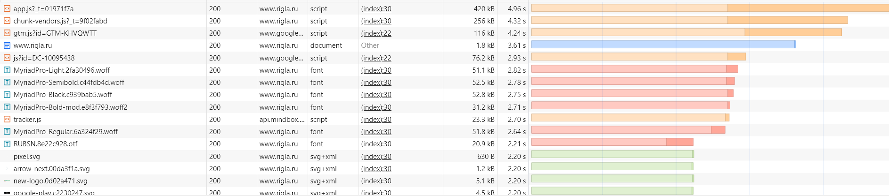

### Блокирующие ресурсы

Ресурсы блокирующие поток загрузки остальных ресурсов:

В основном здесь представлены шрифты и js скрипты.

В сочетании с вкладкой coverage можно провести небольшой анализ и обнаружить, что большинство загруженных скриптов также имеют плохое соотношение использованного к неиспользованному JS.

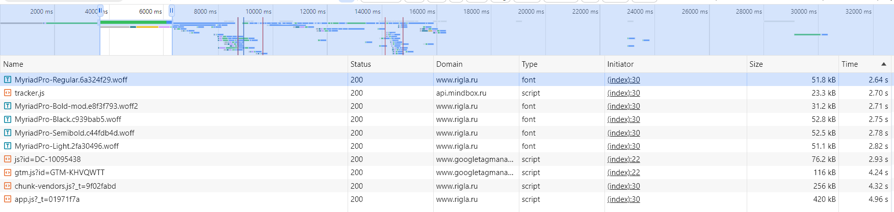

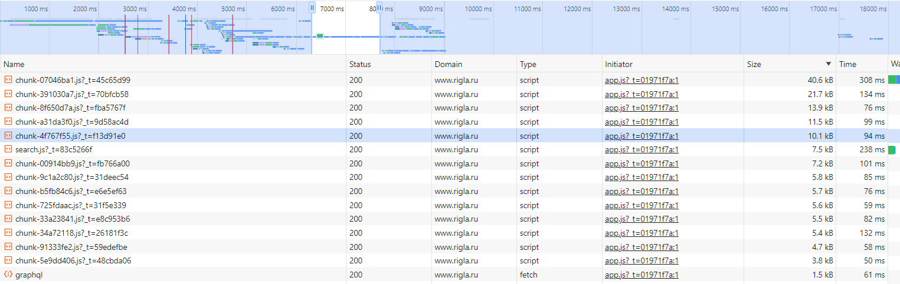

А также присутствует один запрос, который падает в ошибку. Потенциально этот запрос мог что-то поломать.

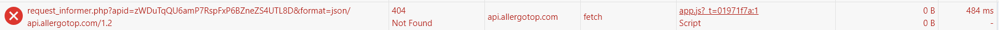

### Что то еще:

Дополнительно можно обратить внимание на запросы c редиректом 302:

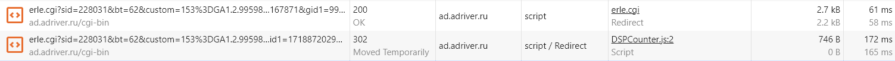

Здесь редирект повторился дважды на 302:

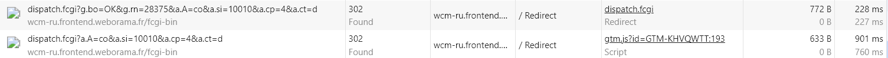

301 вероятно следует обновить адрес:

> Ну и конечно куча аналитики и различных метрик который делают несколько запросов с разными query параметрами 🤷, а некоторые из вызывают цепочку 302.

## На вкладке Performance:

### Записать и сохранить в файл профиль загрузки страницы

[Trace-standart.json](files\Trace-standart.json)

### Измерить время в миллисекундах от начала навигации до событий

First Paint (FP): 3635ms

First Contentful Paint (FCP): 3635ms

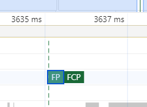

Largest Contentful Paint (LCP): 7833ms

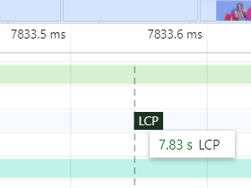

DOM Content Loaded (DCL): 4262ms

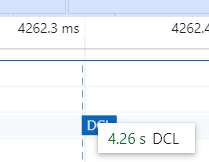

Load (L): 4406ms

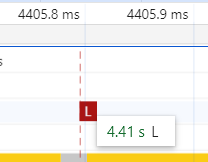

### На каком DOM-элементе происходит LCP:

На элементе img:js-image

### Измерить, сколько времени в миллисекундах тратится на разные этапы обработки документа (Loading, Scripting, Rendering, Painting):

- Loading: 23ms
- Scripting: 2533ms
- Rendering: 273ms
- Painting: 53ms

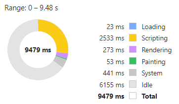

## На вкладке Coverage:

### Cохранить скриншот вкладки после загрузки страницы:

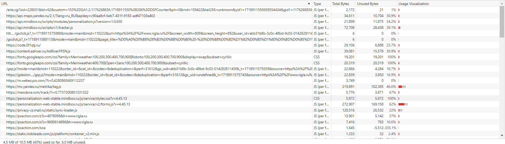

### Измерить в килобайтах объём неиспользованного CSS в ходе загрузки страницы:

~45.4KB

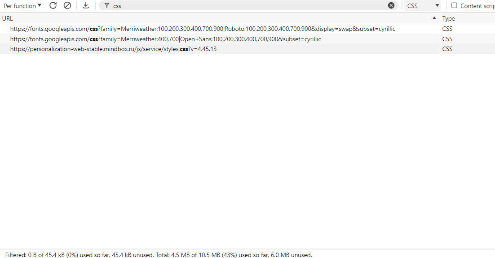

### Измерить в килобайтах объём неиспользованного JS в ходе загрузки страницы:

~5900KB

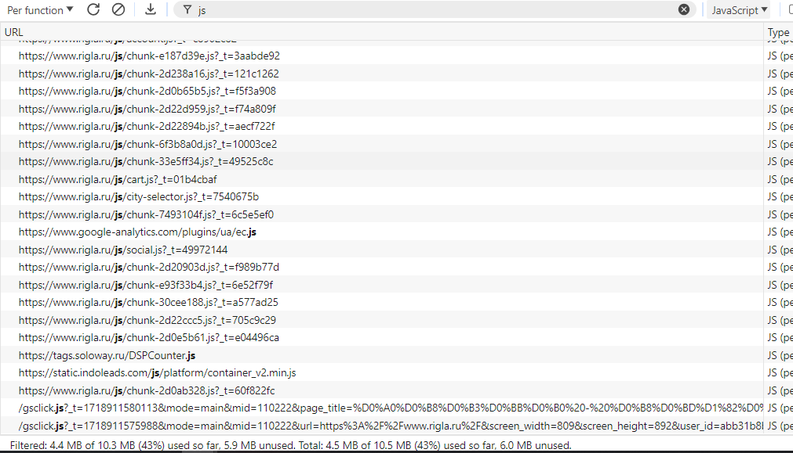

<h1 id="slow-mode">Замедление CPU 4x slowdown и эмуляцию сети Slow 3G</h2>

## На вкладке Network:

### Записать и сохранить в HAR архив профиль загрузки ресурсов при открытии страницы:

[rigla-slow.ru.har](files\www.rigla-slow.ru.har)

Значимых изменений по сравнению со стандартным режимом нет.

## На вкладке Perfomance:

### Записать и сохранить в файл профиль загрузки страницы

[Trace-slow.json](https://drive.google.com/file/d/18hbbPSU9JXHLpP1mEjeZ_nb5hvp6bs9i/view?usp=sharing)

> Гитхабу не понравился профиль на 2 минуты 😞, поэтому гугл диск 😉.

### Измерить время в миллисекундах от начала навигации до событий

First Paint (FP): 24510ms

First Contentful Paint (FCP): 24510ms

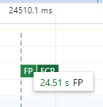

Largest Contentful Paint (LCP): 110414ms

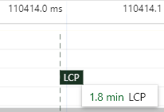

DOM Content Loaded (DCL): 35861ms

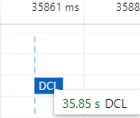

Load (L): 119725ms

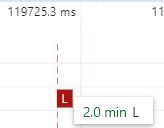

### На каком DOM-элементе происходит LCP:

На элементе img.popup-metadata-type-slider\_\_img

### Измерить, сколько времени в миллисекундах тратится на разные этапы обработки документа (Loading, Scripting, Rendering, Painting):

- Loading: 140ms
- Scripting: 17475ms
- Rendering: 2281ms
- Painting: 2211ms

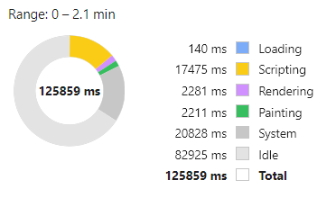

## На вкладке Coverage:

Значимых изменений по сравнению со стандартным режимом нет.

### Cохранить скриншот вкладки после загрузки страницы:

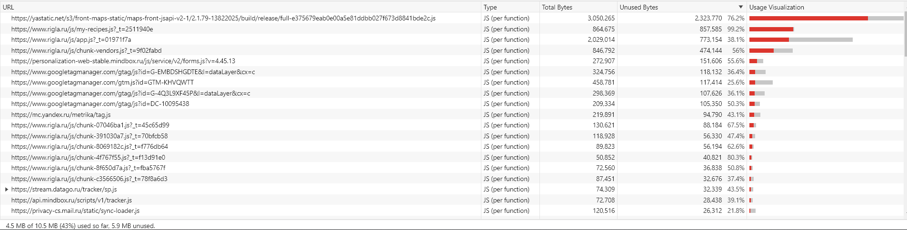
